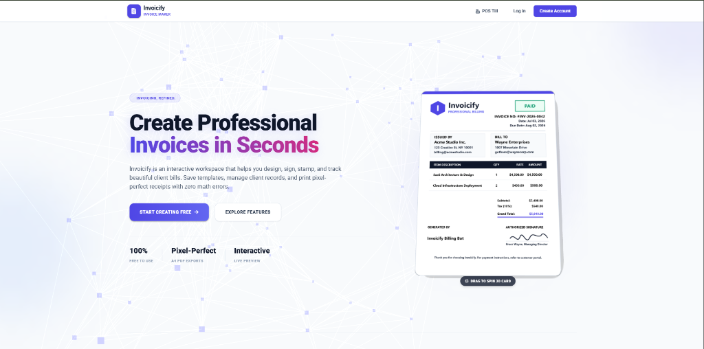
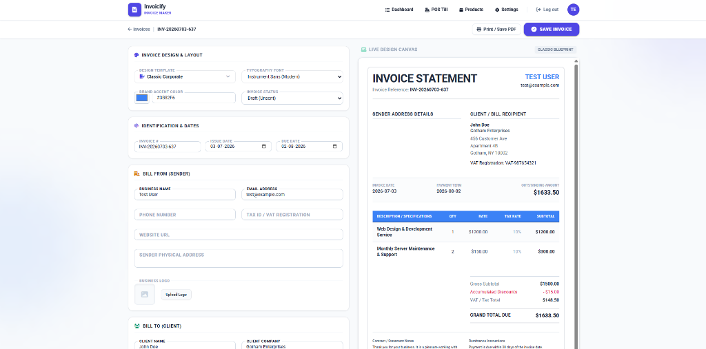
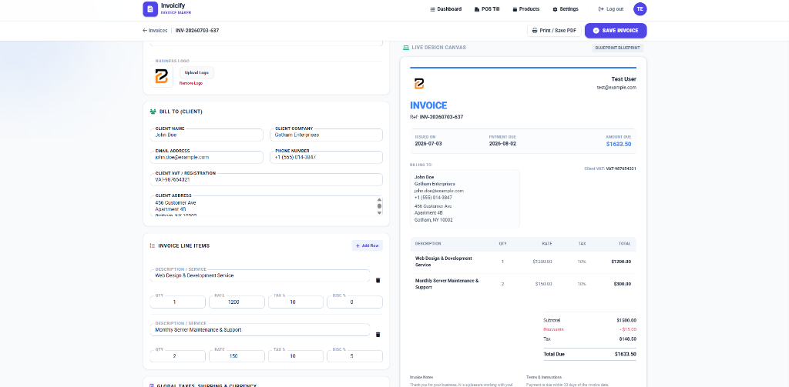
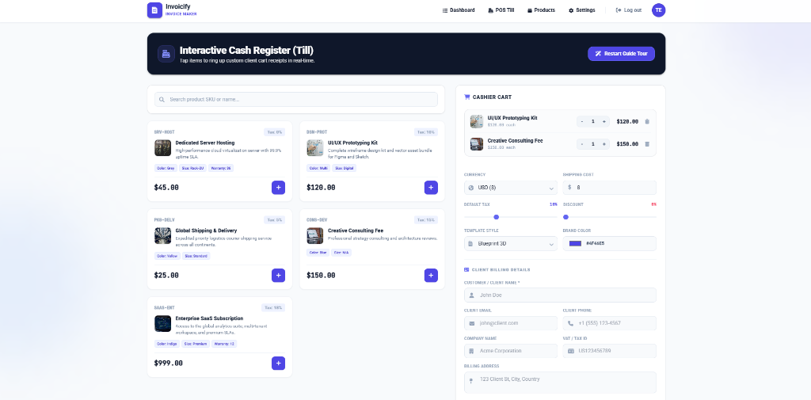

# Invoicify — Invoice Generator & POS Billing System

Invoicify is a modern, high-performance web application designed for professional invoice creation, dynamic layout templates, real-time client billing, and an integrated **Point of Sale (POS) Cashier Register (Till)**. 

Built using **Laravel 12**, **Alpine.js**, and **Tailwind CSS**, Invoicify delivers a premium user experience featuring interactive sandboxes, Google OAuth login, automated email verification, custom dynamic product attribute fields, and secure image uploads.

---

## 📸 Visual Tour

### 1. Interactive Landing Page
Create mock invoices instantly on the landing page workspace using custom range sliders, real-time total updates, and a interactive 3D spin-card preview.


### 2. High-Fidelity Invoice Editor
Customize every facet of client billing with brand color palettes, template styles (Modern, Classic, Blueprint, Slate, Creative), dynamic line item builders, and logo uploads.



### 3. POS Cash Register (Till)
An interactive point-of-sale checkout register featuring instant product filtering, dynamic custom field displays, monospaced cashier totals, and customer billing forms.


---

## ✨ Key Features

- **Guest Invoice Sandbox**: Create and preview invoices as a guest. All guest invoices are cached in session and automatically claimed/linked to your profile once you register or log in.
- **Interactive POS Till**: Search seeded product catalogs by SKU or name, adjust quantities using modern selector pills, review line-item previews, and instantly trigger invoice printing on checkout.
- **Google OAuth Login**: Safe, secure, and dependency-free social sign-in. Auto-verifies users' emails on registration.
- **Dynamic Field Builder**: Build custom stock attributes (Warranty, Size, Color, Serial No.) via a tabbed settings dashboard, with type-safe backend validation constraints (Regex, min/max limits, requirements, tooltips).
- **ImgBB Image Proxy Uploads**: Convert product images directly in the browser to WebP using HTML Canvas, and upload via a secure serverside proxy that keeps system API keys hidden from client scripts.
- **SMTP Email Verification**: Enforces account email verification on registration utilizing Hostinger SMTP servers and secure signed temporary links.
- **Historical Revenue Analytics**: Visualize paid and outstanding invoicing logs dynamically across a 6-month stacked bar chart dashboard.

---

## 🛠️ Tech Stack

* **Framework**: Laravel 12 (PHP 8.2+)
* **Database**: MySQL / MariaDB
* **Frontend**: Alpine.js, Tailwind CSS (Vanilla blade integrations)
* **Testing**: Pest PHP (v3) / PHPUnit
* **Formatter**: Laravel Pint

---

## 🚀 Setup & Installation

### 1. Clone the repository
```bash
git clone https://github.com/developer1379/Invoice-generator-and-billing-system.git
cd Invoice-generator-and-billing-system
```

### 2. Configure Environment Variables
Copy the `.env.example` file to `.env`:
```bash
cp .env.example .env
```
Populate your database credentials, SMTP configuration details, and Google/ImgBB keys:
```env
DB_CONNECTION=mysql
DB_HOST=127.0.0.1
DB_PORT=3306
DB_DATABASE=your_database
DB_USERNAME=your_username
DB_PASSWORD=your_password

# SMTP Mail Settings
MAIL_MAILER=smtp
MAIL_HOST=smtp.hostinger.com
MAIL_PORT=465
MAIL_USERNAME=enquiry@backendcodersindia.com
MAIL_PASSWORD="your-smtp-password"
MAIL_ENCRYPTION=ssl
MAIL_FROM_ADDRESS=enquiry@backendcodersindia.com
MAIL_FROM_NAME="Backend Coders"

# API & Integrations
IMGBB_API_KEY=your-imgbb-key
GOOGLE_CLIENT_ID=your-google-client-id
GOOGLE_CLIENT_SECRET=your-google-client-secret
GOOGLE_REDIRECT_URI="${APP_URL}/auth/google/callback"
```

### 3. Install Dependencies & Build
Install PHP packages, compile CSS/JS assets, generate the application key, and run migrations:
```bash
composer install
npm install
npm run build
php artisan key:generate
```

### 4. Database Migrations & Seeding
Execute database migrations and populate realistic test products (preloaded with description details, images, and custom fields):
```bash
php artisan migrate --seed
```

### 5. Start the local server
Run the development server:
```bash
php artisan serve
```
Open `http://localhost:8000` in your web browser.

---

## 🧪 Testing

To execute the Pest test suite and assert endpoint functionality, authentication, and custom validation constraints, run:
```bash
php artisan test --compact
```
Currently, **all tests pass successfully**.

---

## 📄 License

This project is open-sourced software licensed under the [MIT license](LICENSE).

---

## 🤝 Pair Programming

This codebase was developed in pair-programming collaboration with **Antigravity**, the agentic AI coding assistant designed by Google DeepMind.